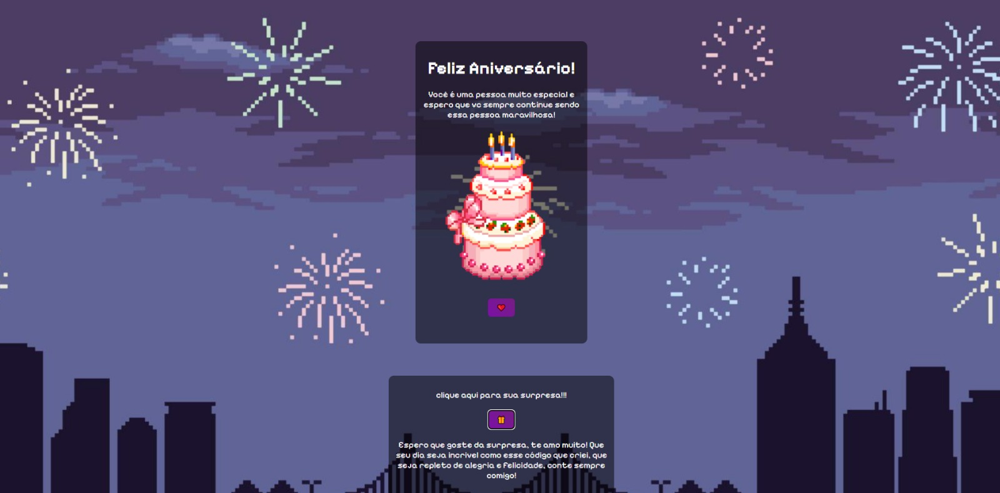

# Feliz Aniversario 🎁🎁🎁
site de feliz aniversario, logo mais sera mais implementado para ter mais funções de personalização

  

## Parabenização de aniversário feita com programação frontend "a mão" para demonstrar a importancia da pessoa felicitada

<ul>
<li>Interatividade:
Botão de coração que quando se clica sai corações em toda tela, e o botão de presente que solta confete e libera uma mensagem especial.
  
<li>Design Minimalista & Intuitivo: Interface limpa simples e direta.

<li>Performance e adaptabilidade: responsivo em qualquer plataforma seja pc ou mobile.
</ul>

---

## 🛠️ Tecnologias Utilizadas

- CSS
- HTML
- JavaScript
- VScode
- GitHub (postagem do site)
